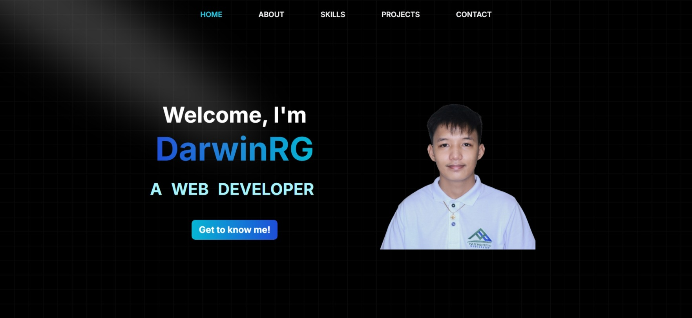

# Revamped Portfolio

This is a modern and responsive portfolio website built using Next.js, Tailwind CSS, and TypeScript. It showcases personal projects, skills, certifications, and contact information in an interactive and visually appealing way.

## Features

- **Home Page**: A welcoming introduction with a typewriter effect and a call-to-action button.
- **About Page**: Detailed information about education, work experience, and certifications.
- **Skills Page**: A hoverable grid showcasing technical skills with icons.
- **Projects Page**: A list of personal projects with descriptions, links to live demos, and GitHub repositories.
- **Contact Page**: A contact form with validation and email functionality using the Resend API.
- **Responsive Design**: Fully optimized for desktop and mobile devices.
- **Animations**: Smooth animations using Framer Motion and custom effects.

## Technologies Used

- **Framework**: [Next.js](https://nextjs.org/)
- **Styling**: [Tailwind CSS](https://tailwindcss.com/)
- **TypeScript**: For type safety and better developer experience.
- **Framer Motion**: For animations and transitions.
- **React Hot Toast**: For notifications.
- **Resend API**: For handling email functionality.

## Live Website

The portfolio is deployed and can be accessed at [darwinrg.me](https://darwinrg.me). Feel free to visit to see all the features in action.

## License

This project is licensed under the [MIT License](LICENSE) - see the LICENSE file for details.
